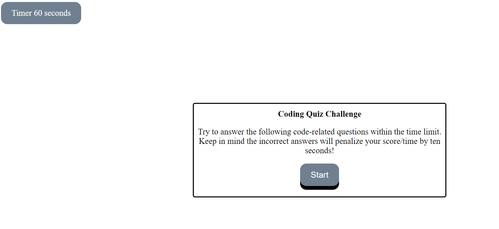

# jm-code-quiz

A timed coding quiz with multiple-choice questions.

## Description

I began by building the HTML questions. Once it was built I struggled with a way to push and pull different questions into view. In order to rectify this problem, I built an array in javascript with the correct answers. In HTML, I listed a function which is triggered when the test taker clicks on the different answer options. The function compares the selected answer with the correct answers in the array.

On the last question box, a text box is shown with initial input. A button allows the final score amount to be shown.

https://janee-elise-mays.github.io/jm-code-quiz/

